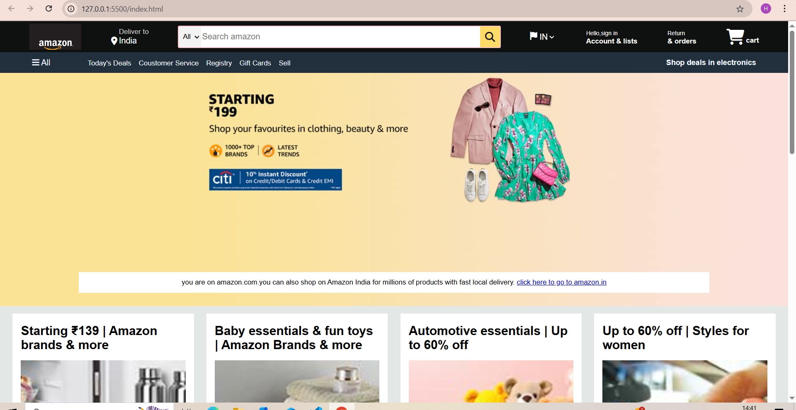
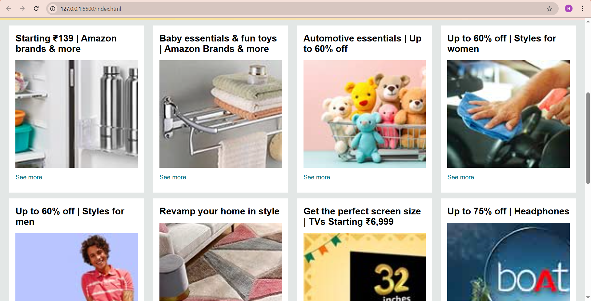
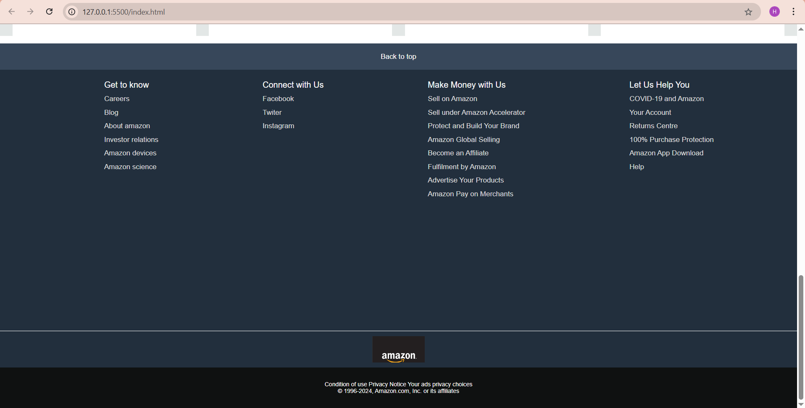

🛍️ Amazon Clone
This project is a fully front-end clone of the Amazon India homepage, developed using HTML5 and CSS3. The goal of this project is to replicate the design and structure of Amazon’s main landing page to strengthen frontend development skills, particularly in layout design, styling, responsiveness, and user interface elements.
---

---
📖 About the Project
This project is a static clone of the Amazon India homepage UI, built without JavaScript or backend functionalities. The aim was to reproduce the layout and appearance of the Amazon shopping experience using only HTML and CSS.

By completing this project, the developer practiced:

HTML semantics and structure

CSS layout techniques (Flexbox)

Responsive design elements (basic)

Component styling and positioning

Use of web fonts and icons via Font Awesome

It serves as a portfolio-worthy piece for frontend development practice and demonstration.

----
🌟 Features

✅ Responsive Navigation Bar

✅ Location and Country Selector

✅ Search Bar with Icon

✅ User Account & Returns Section

✅ Shopping Cart Icon

✅ Responsive Panel Section

✅ Promotional Hero Banner

✅ Grid-based Shop Sections with Images

✅ Footer Section with Useful Links

✅ Hover Effects and Interactive Visuals

---
🧰 Tech Stack Used

Technology	      Description

HTML5           	Markup language for structure

CSS3	            Styling and layout

Font Awesome	    For icons and visual cues

---
🚀 How to Run the Project

Download or clone the repository:

git clone https://github.com/yourusername/amazon-homepage-clone.git

Make sure all image files are in the same folder as index.html.

Open index.html with your preferred browser:

Right-click on index.html → Open with → Browser (Chrome/Firefox/Edge)

Explore the layout and components.

---
🎯 Future Improvements

✅ Make the layout fully responsive for all screen sizes (media queries)

✅ Add JavaScript functionality for dropdown menus and interactive elements

✅ Integrate a carousel slider in the hero section

✅ Add actual product links or dummy product data using JSON

✅ Modularize code using SASS or SCSS

✅ Deploy live using GitHub Pages, Netlify, or Vercel

---
Credits

Font Awesome – for providing the icons used in navbar and other sections.

Amazon.in – for design inspiration and reference.

---
📌 Disclaimer

This project is intended for educational purposes only. It is a personal clone to practice frontend development. All images and references to Amazon are solely used for learning and non-commercial purposes.
